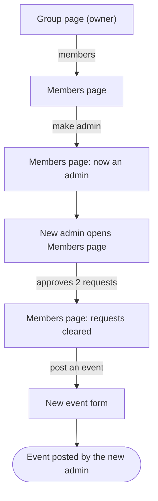
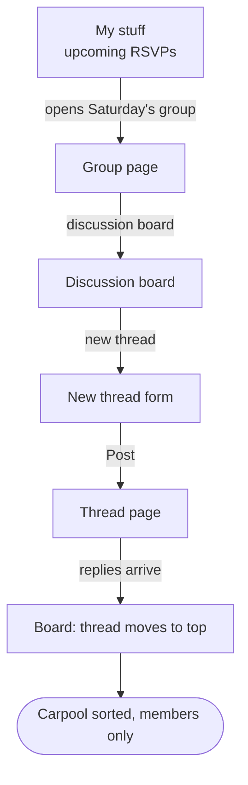
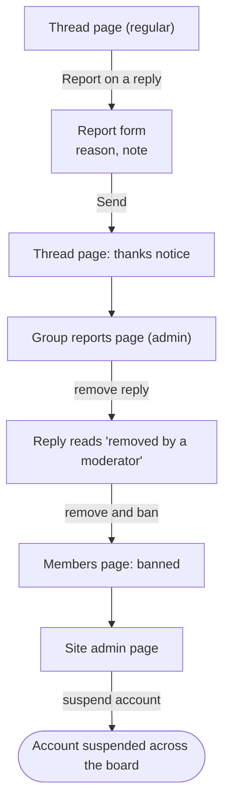
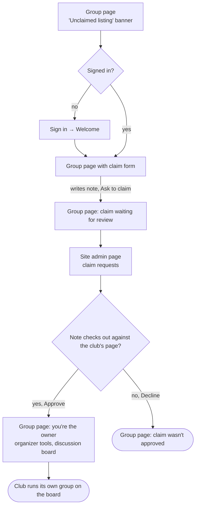
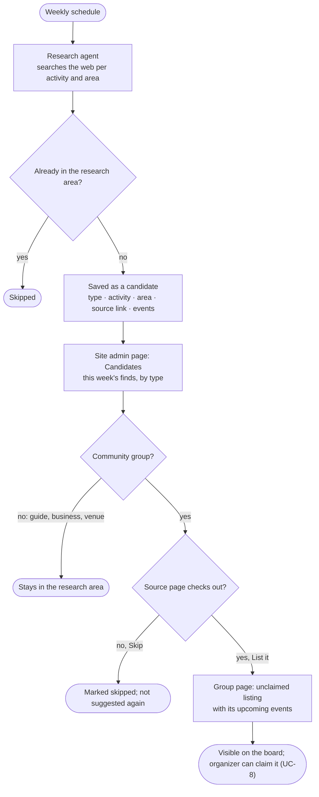
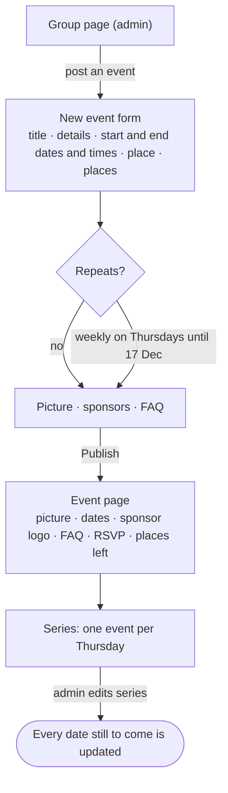
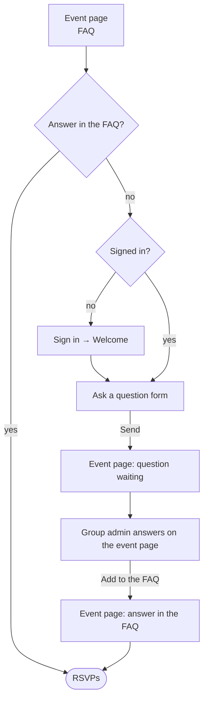
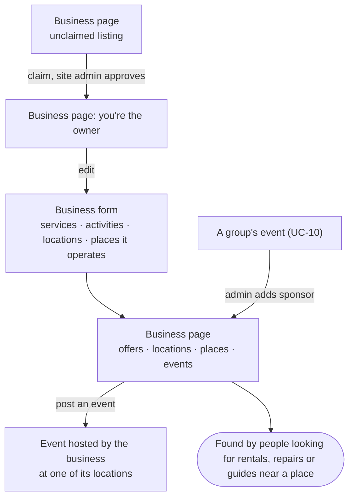
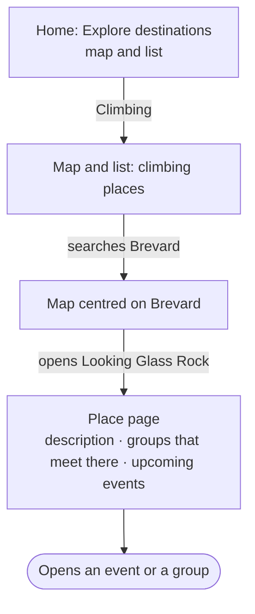
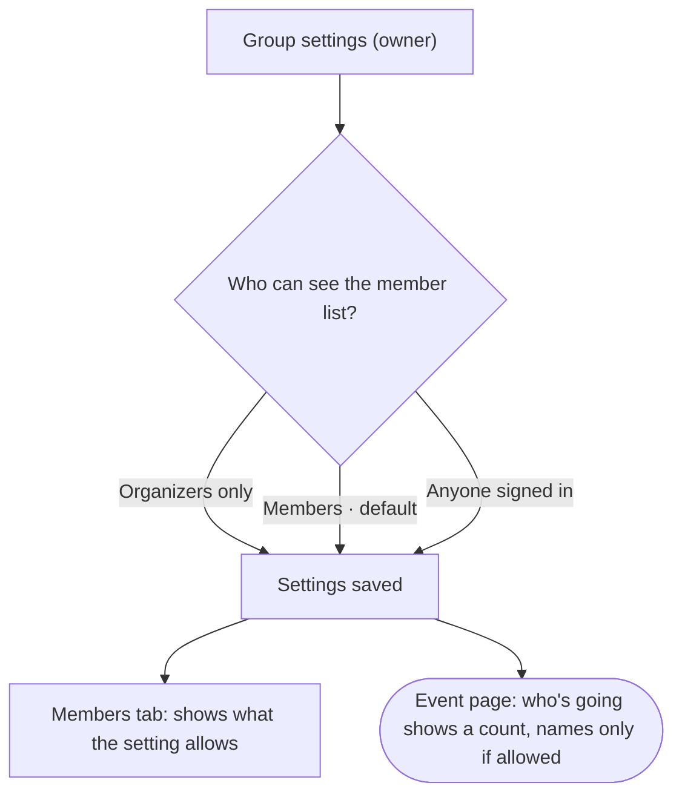

# User flows

One diagram per [use case](./use-cases): the screens a person moves
through on the main path, and the decisions where the path could split.
Rectangles are screens, diamonds are decisions, and rounded boxes are
where the flow ends. A split is shown only where it changes which screen
comes next; the full list of alternative paths and edge cases lives in the
[functional requirements](./functional-requirements).

The diagrams are [Mermaid](https://mermaid.js.org/), which GitHub renders
in place.

## UC-1 — What's out there?


## UC-2 — Join and show up


## UC-3 — Start a group


## UC-4 — Share the work



## UC-5 — Sort out the carpool



## UC-6 — Something's wrong



## UC-7 — Something to do this weekend


## UC-8 — This is my club



## UC-9 — Keep the listings fresh

*Approved 8 October 2026.*



## UC-10 — Post a ride series

*Draft, awaiting review.*



## UC-11 — Ask before you go

*Draft, awaiting review.*



## UC-12 — A bike shop on the board

*Draft, awaiting review.*



## UC-13 — A local chapter of a national club

*Draft, awaiting review.*


## UC-14 — What's near me?

*Draft, awaiting review.*


## UC-15 — Explore destinations

*Draft, awaiting review.*



## UC-16 — Keep our member list private

*Draft, awaiting review.*



## UC-17 — Approve who comes

*Draft, awaiting review.*


## UC-18 — My calendar

*Draft, awaiting review.*


## UC-19 — Reply to a reply

*Draft, awaiting review.*


## UC-20 — Message another member

*Draft, awaiting review.*


## UC-21 — Share trip photos

*Draft, awaiting review.*

```mermaid
flowchart TD
  group["Group page: Photos tab"] -->|Upload| upload["Choose up to 10 photos"]
  upload -->|Post| gallery["Gallery, newest first"]
  gallery -->|open one| full["Photo full size"]
  full -->|author removes| removed(["Gone from the gallery"])
  full -->|organizer removes| modded(["Removed, logged as moderation"])
```

## UC-22 — Save it for later

*Draft, awaiting review.*

```mermaid
flowchart TD
  event["Event page<br/>RSVPs open Tue 14 Oct, 9:00 am"] -->|Save| saved["My stuff: Saved"]
  saved --> opens{RSVPs open}
  opens --> reminder["Reminders: RSVPs are open"]
  reminder -->|opens event| rsvp(["RSVPs, or unsaves"])
```

## UC-23 — What needs my attention

*Draft, awaiting review.*

```mermaid
flowchart TD
  home["Signed-in home: Reminders<br/>join and RSVP requests · tomorrow · nearly full · RSVPs open · new thread · new message"] -->|opens an item| item["The page that needs them"]
  item -->|handled| home
  home --> mine["My communities<br/>next event · latest thread · manage links"]
  mine --> done(["Nothing left needing them"])
```
