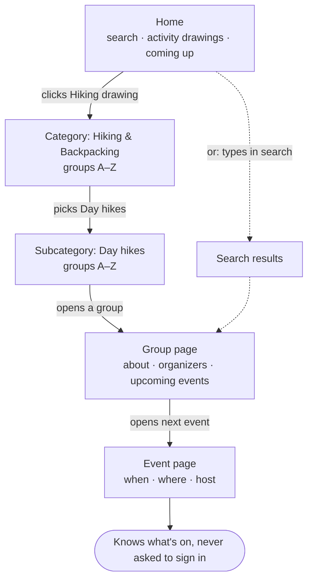
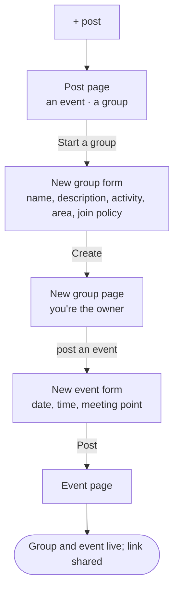
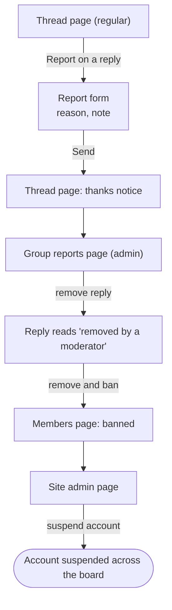
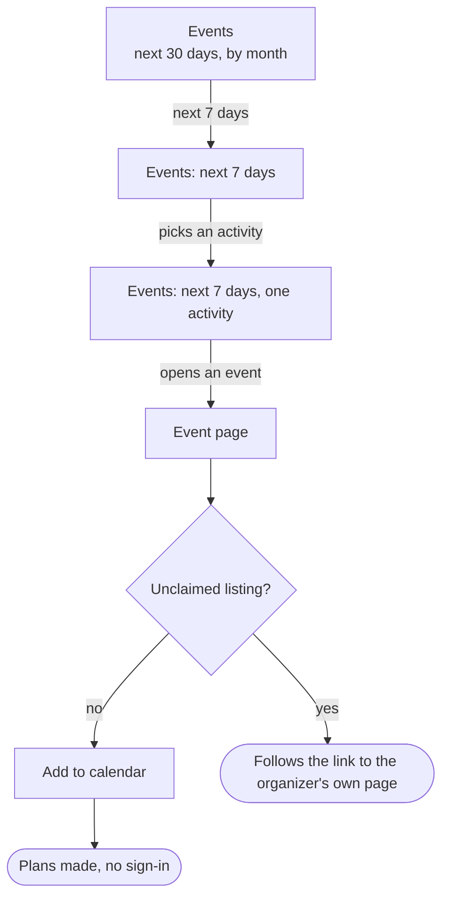

# User flows

One diagram per [use case](./use-cases): the screens a person moves
through on the main path, and the decisions where the path could split.
Rectangles are screens, diamonds are decisions, and rounded boxes are
where the flow ends. A split is shown only where it changes which screen
comes next; the full list of alternative paths and edge cases lives in the
[functional requirements](./functional-requirements).

The diagrams are [Mermaid](https://mermaid.js.org/), which GitHub renders
in place.

## UC-1 — What's out there?

## UC-2 — Join and show up

## UC-3 — Start a group

## UC-4 — Share the work

## UC-5 — Sort out the carpool

## UC-6 — Something's wrong

## UC-7 — Something to do this weekend

## UC-8 — This is my club

## UC-9 — Keep the listings fresh

*Approved 8 October 2026.*

