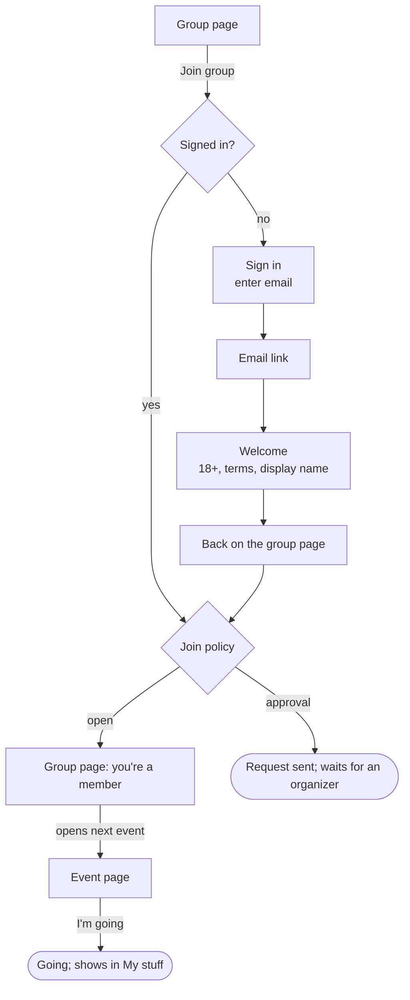
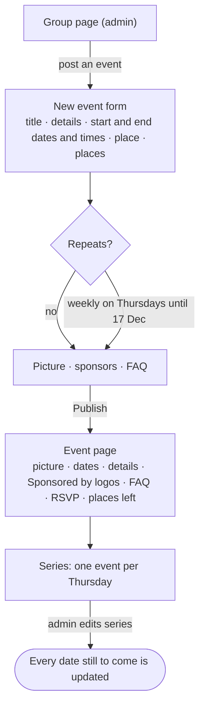
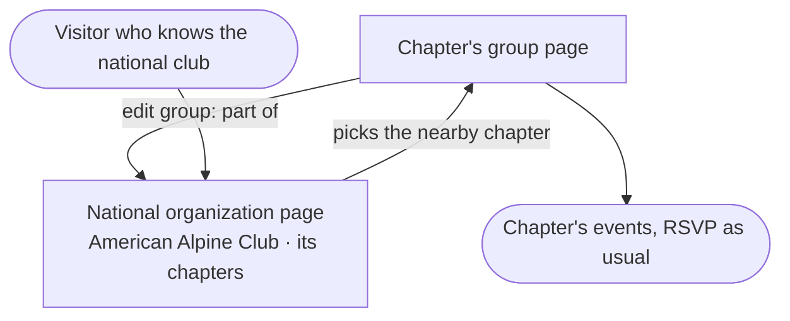
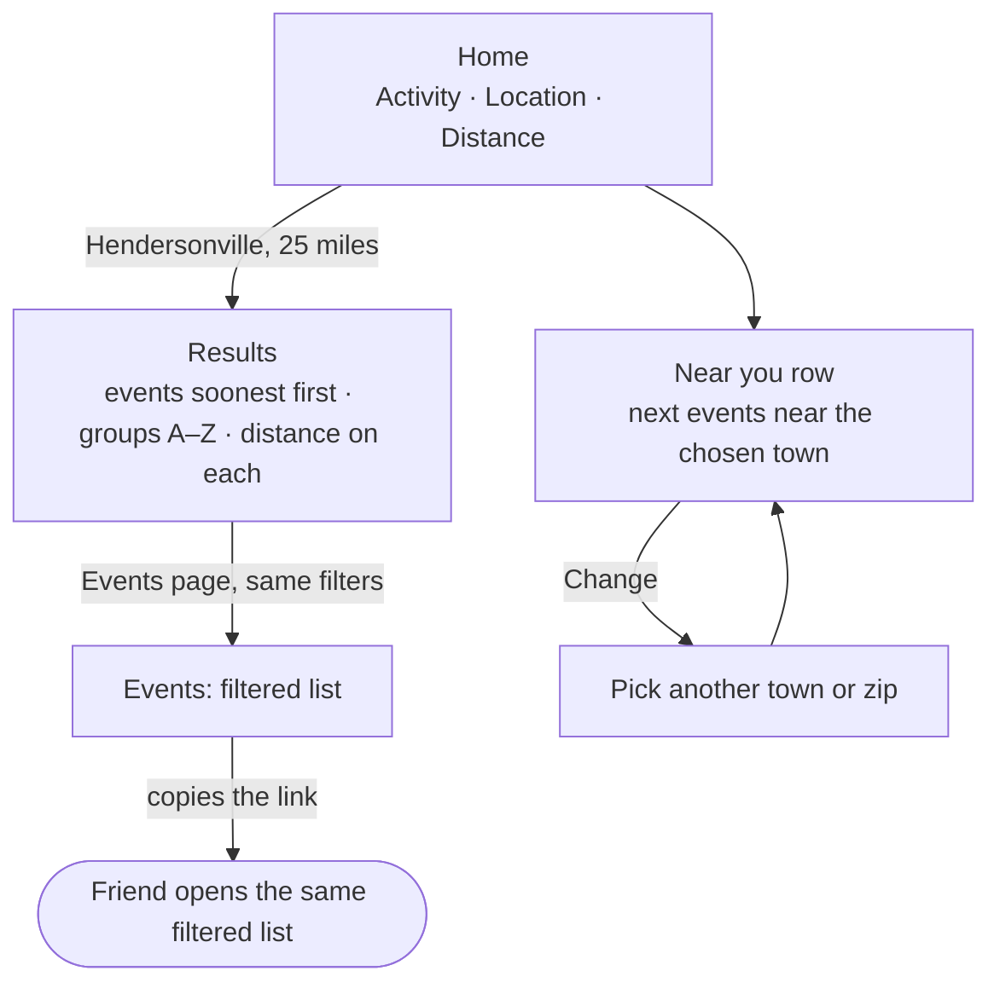
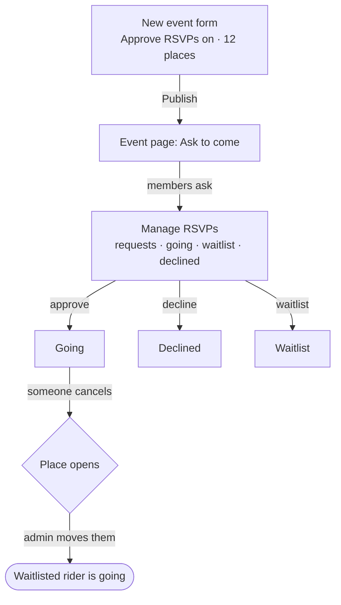
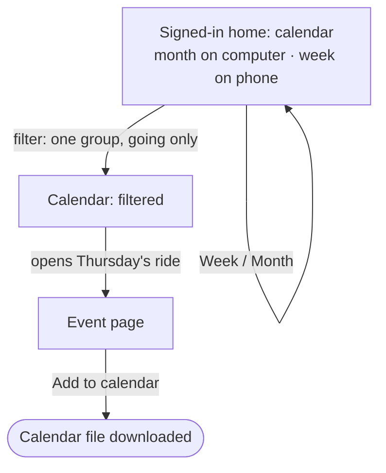
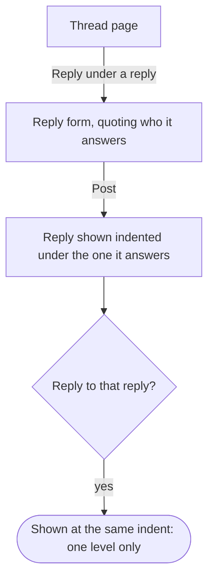
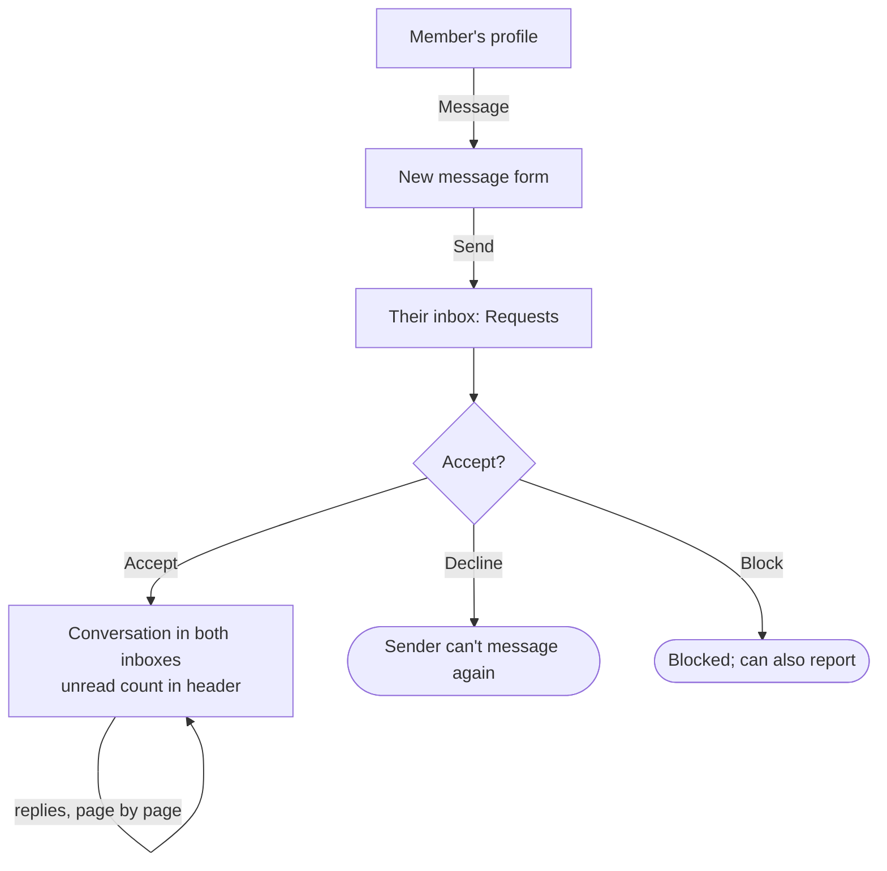

# User flows

One diagram per [use case](./use-cases): the screens a person moves
through on the main path, and the decisions where the path could split.
Rectangles are screens, diamonds are decisions, and rounded boxes are
where the flow ends. A split is shown only where it changes which screen
comes next; the full list of alternative paths and edge cases lives in the
[functional requirements](./functional-requirements).

The diagrams are [Mermaid](https://mermaid.js.org/), which GitHub renders
in place.

## UC-1 — What's out there?


## UC-2 — Join and show up



## UC-3 — Start a group


## UC-4 — Share the work


## UC-5 — Sort out the carpool


## UC-6 — Something's wrong


## UC-7 — Something to do this weekend


## UC-8 — This is my club


## UC-9 — Keep the listings fresh

*Approved 8 October 2026.*


## UC-10 — Post a ride series

*Draft, awaiting review.*



## UC-11 — Ask before you go

*Draft, awaiting review.*


## UC-12 — A bike shop on the board

*Draft, awaiting review.*



```mermaid
flowchart TD
  signin["Sign in with the business email"] --> listed["Business page<br/>unclaimed listing"]
  listed -->|claim, site admin checks email against website| owner["Business page: you're the owner"]
  owner -->|edit| form["Business form<br/>services · activities · locations · places it operates"]
  owner -->|Admins| admins["Add staff by their own accounts"]
  owner -->|Start a group, link it| group["Business's group<br/>its own owner and admins"]
  group -->|Post an event| event["Event hosted by the group<br/>at one of the shops"]
  form --> page["Business page<br/>offers · locations · places · group and its events · events it sponsors"]
  event --> page
  sponsor["Another group's event (UC-10)"] -->|admin adds sponsor| sponsored["Event page: Sponsored by logos<br/>below the details"]
  sponsored --> page
  page --> done(["Found by people looking for rentals, repairs or guides near a place"])
```

## UC-13 — A local chapter of a national club

*Draft, awaiting review.*



## UC-14 — What's near me?

*Draft, awaiting review.*



## UC-15 — Explore destinations

*Draft, awaiting review.*


## UC-16 — Keep our member list private

*Draft, awaiting review.*


## UC-17 — Approve who comes

*Draft, awaiting review.*



## UC-18 — My calendar

*Draft, awaiting review.*



## UC-19 — Reply to a reply

*Draft, awaiting review.*



## UC-20 — Message another member

*Draft, awaiting review.*



## UC-21 — Share trip photos

*Draft, awaiting review.*

```mermaid
flowchart TD
  group["Group page: Photos tab"] -->|Upload| upload["Choose up to 10 photos"]
  upload -->|Post| gallery["Gallery, newest first"]
  gallery -->|open one| full["Photo full size"]
  full -->|author removes| removed(["Gone from the gallery"])
  full -->|organizer removes| modded(["Removed, logged as moderation"])
```

## UC-22 — Save it for later

*Draft, awaiting review.*

```mermaid
flowchart TD
  event["Event page<br/>RSVPs open Tue 14 Oct, 9:00 am"] -->|Save| saved["My stuff: Saved"]
  saved --> opens{RSVPs open}
  opens --> reminder["Reminders: RSVPs are open"]
  reminder -->|opens event| rsvp(["RSVPs, or unsaves"])
```

## UC-24 — Tell groups apart

*Draft, awaiting review.*

```mermaid
flowchart TD
  list["Communities<br/>photo · type icon and label · activity icons"] -->|filter: Volunteer group| filtered["Communities: volunteer groups"]
  filtered -->|opens one| group["Group page<br/>photo · type · area · members"]
  owner["Group settings (owner)"] -->|sets type and photo| group
  group --> done(["Knows what kind of group it is"])
```

## UC-23 — What needs my attention

*Draft, awaiting review.*

```mermaid
flowchart TD
  home["Signed-in home: Reminders<br/>join and RSVP requests · tomorrow · nearly full · RSVPs open · new thread · new message"] -->|opens an item| item["The page that needs them"]
  item -->|handled| home
  home --> mine["My communities<br/>next event · latest thread · manage links"]
  mine --> done(["Nothing left needing them"])
```

## UC-25 — A sign-in email that sounds like us

*Draft, awaiting review. Needs the domain and Resend before it can ship.*

```mermaid
flowchart TD
  signin["Sign in<br/>enter email"] -->|Send me a link| check["Check your email"]
  check --> first{First sign-in?}
  first -->|yes| welcomeMail["Email from Branch Outdoors<br/>welcome line · link · works for 1 hour · ignore if not you"]
  first -->|no| signinMail["Email from Branch Outdoors<br/>link · works for 1 hour · ignore if not you"]
  welcomeMail -->|clicks link| welcome["Welcome<br/>18+, terms, display name"]
  signinMail -->|clicks link| back(["Back on the page they started from"])
  welcome --> back
```

## UC-26 — Prove it's my club

*Draft, awaiting review. Needs the domain and Resend before it can ship.*

```mermaid
flowchart TD
  claim["Group page: claim form<br/>note · optional club email"] --> email{Club email given?}
  email -->|no| waiting["Group page: claim waiting for review"]
  email -->|yes, at the website's domain| sent["Group page: link sent to that address<br/>claim waiting for review"]
  sent -->|clicks link in time| confirmed["Confirmed at brevardpaddlers.org"]
  sent -.->|never clicks, or link expires| waiting
  confirmed --> admin["Site admin page: claim requests<br/>'Confirmed at …' or 'Not confirmed'"]
  waiting --> admin
  admin --> decide{Note and confirmation check out?}
  decide -->|yes, Approve| owner(["Group page: you're the owner"])
  decide -->|no, Decline| declined(["Group page: claim wasn't approved"])
```

## UC-27 — Start your first group

*Draft, awaiting review. Decision needed: drawn for "approve only a
person's first group".*

```mermaid
flowchart TD
  start["Start a group form<br/>'first groups are checked before listing'"] -->|Create| first{Already has an approved group?}
  first -->|yes| listed["Group page: listed, open to join"]
  first -->|no| pending["Group page: Waiting for review<br/>visible to them and the site admin"]
  pending --> admin["Site admin page: New groups"]
  admin --> decide{Real outdoor group?}
  decide -->|yes, Approve| listed
  decide -->|no, Decline with a reason| declined(["Group page: not approved, with the reason"])
  listed -->|posts first event| done(["Group is live"])
```

## UC-28 — Look around as a member

*Draft, awaiting review. Decision needed: drawn for the read-only demo
member on the live board.*

```mermaid
flowchart TD
  signin["Sign-in page"] -->|Look around as a demo member| demo["Signed in as Demo member<br/>band: nothing you do here is saved"]
  demo --> browse["Demo groups: discussions, members,<br/>who's going, My stuff"]
  browse --> act{Tries to RSVP, post, join or report?}
  act -->|yes| refuse["Button explains: the demo can look, not change<br/>link: sign in for real"]
  act -->|no| browse
  refuse --> browse
  browse -->|Sign out, or one hour passes| out(["Signed out"])
```

## UC-29 — Sign up with an email and a password

*Draft, awaiting review. Open sign-up with email confirmation; password only.*

```mermaid
flowchart TD
  join["Group page: Join group"] --> signin["Sign in<br/>email + password<br/>links: Create an account · Forgot password"]
  signin -->|Create an account| signup["Create an account<br/>email, password, password again"]
  signup -->|Create account| check(["Check your email to confirm your address"])
  check -->|clicks Confirm my email| welcome["Welcome: 18+, terms, display name"]
  welcome --> back["Back on the group page: Join"]
  signin -->|correct email + password| back
  signin -->|wrong, or email not confirmed| signin
  signin -->|Forgot password| forgot["Forgot password: email"]
  forgot --> resetmail(["Check your email for a reset link"])
  resetmail -->|clicks the link| newpw["Set a new password"]
  newpw --> back
```

## UC-30 — Post an event people want to come to

*Draft, awaiting review.*

```mermaid
flowchart TD
  start["Group page: Post an event"] --> form["Event form<br/>title, dates, place<br/>Description (required), Details (optional)<br/>Photo + its description (optional)"]
  form --> price{Free or Paid?}
  price -->|Free| rsvp{Take RSVPs on Branch Outdoors?}
  price -->|Paid| cost["Registration fee, Total cost (text)"] --> rsvp
  rsvp -->|yes| places["Places (optional)<br/>Waitlist when full (tick)"] --> publish
  rsvp -->|no| link["Sign-up link (optional)"] --> publish
  publish["Publish"] --> page(["Event page: photo, description, price, details,<br/>RSVP buttons and places left, or Sign up at …"])
  page -->|full, waitlist on| wait["Members join the waitlist in order"]
  wait -->|someone drops out| move(["Organizer moves the next person to going"])
```

## UC-31 — Bring people into the group

*Draft, awaiting review.*

```mermaid
flowchart TD
  members["Members page (page admin)"] --> mgr["Page managers: pick a member, or enter an email"]
  mgr --> cap{Already two managers?}
  cap -->|yes| full(["Remove one first"])
  cap -->|no, a member| made(["They are a page manager"])
  cap -->|no, an email| mgrmail["Manager invite email"] --> accept["They sign up or sign in and accept"] --> made
  members --> invite["Invite people: 1 to 25 emails"] --> sent(["One email per address with a join link"])
  members --> link["Invite link: Create, copy, turn off"]
  sent --> open
  link --> open["Someone opens the link"]
  open --> signed{Signed in?}
  signed -->|no| signin["Sign up or sign in"] --> join
  signed -->|yes| join{Banned, or link off or expired?}
  join -->|no| member(["Member of the group, no approval needed"])
  join -->|yes| refuse(["This link doesn't work. Ask the group for a new one"])
```
